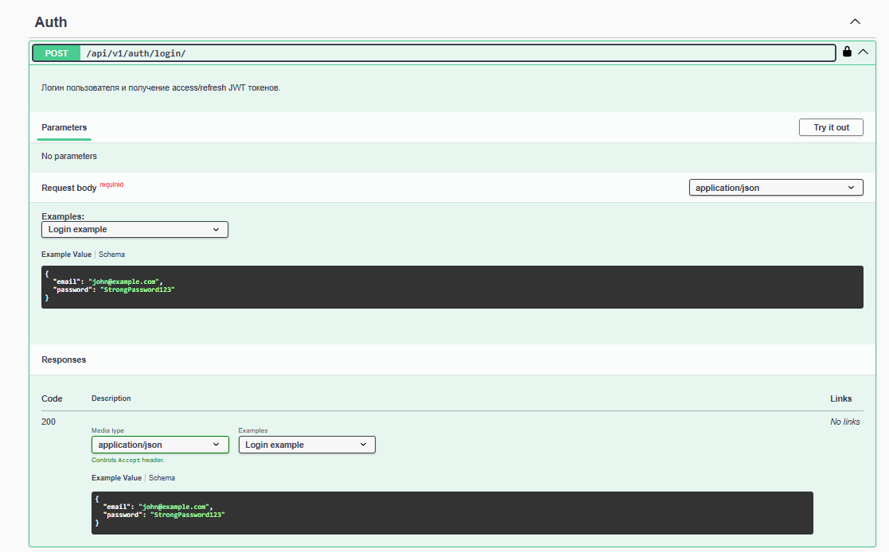
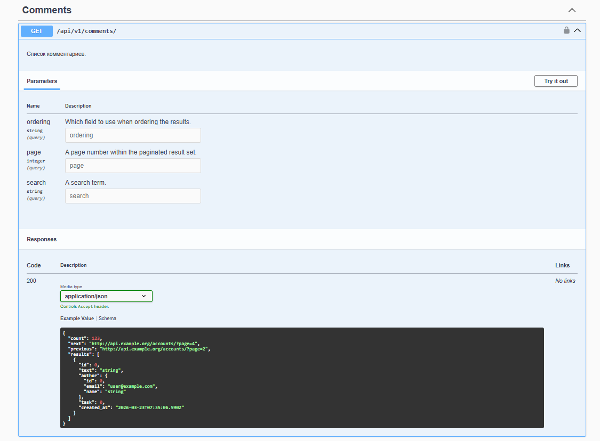
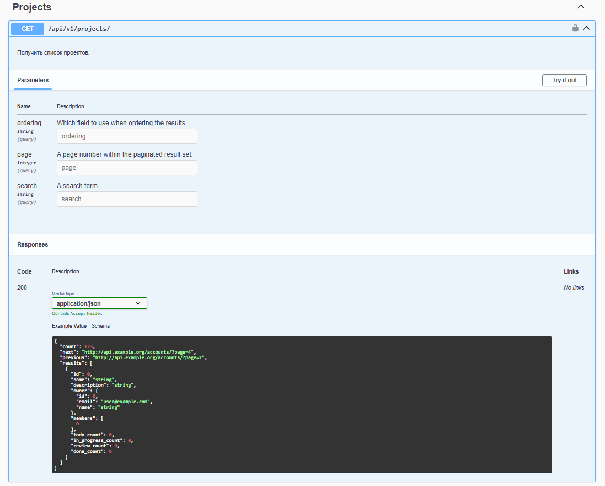
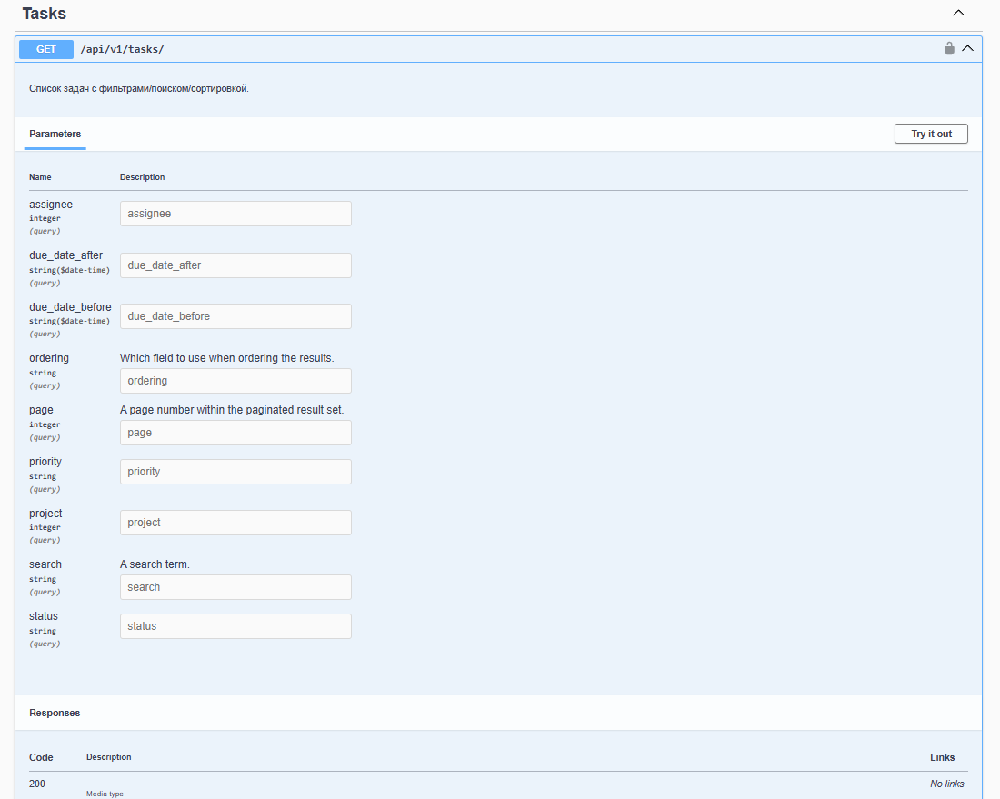
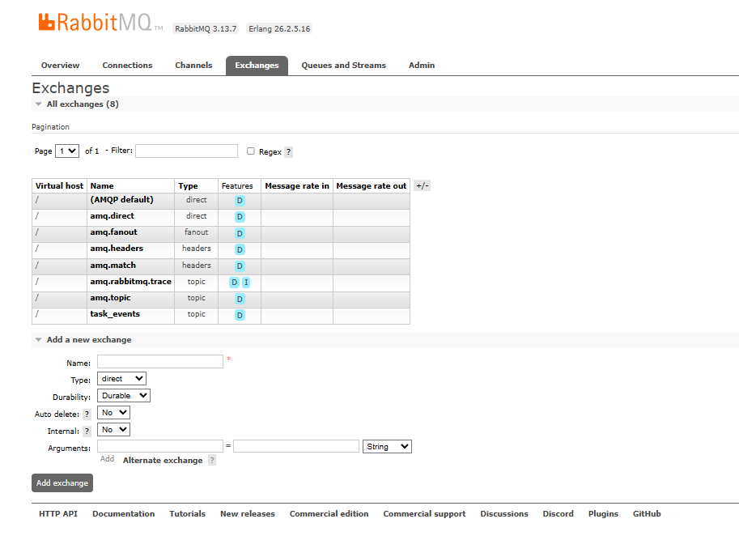
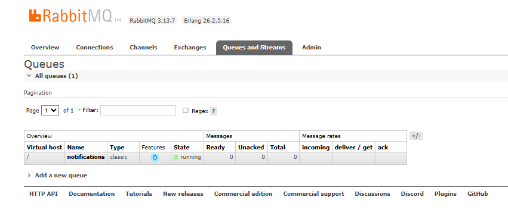

# TaskFlow

[](https://github.com/sayomiyori/TaskFlow/actions/workflows/ci.yml)
[](https://codecov.io/gh/sayomiyori/TaskFlow)


TaskFlow is a backend platform for collaborative task management built around a Django core API and an event-driven notification pipeline.  
It combines REST + WebSockets for realtime updates and RabbitMQ-driven asynchronous delivery to external channels (email, Telegram, WS fanout).  
The architecture is split into domain API services and notification processing services to keep business workflows scalable.

## Architecture

```text
                        +----------------------+
                        |        Client        |
                        |  REST + WS Consumer  |
                        +----------+-----------+
                                   |
                            HTTP/WS via :80
                                   |
                         +---------v---------+
                         |       Nginx       |
                         | reverse proxy/rate|
                         +----+---------+----+
                              |         |
                   /api,/ws   |         | /notifications
                              |         |
                   +----------v--+   +--v------------------+
                   |   Django API |   | FastAPI Notification|
                   | DRF+Channels |   | Service (consumer)  |
                   +------+-------+   +----------+----------+
                          |                      |
                          | publish task events  |
                          +----------+-----------+
                                     |
                                +----v----+
                                |RabbitMQ |
                                |topic ex |
                                +----+----+
                                     |
                   +-----------------+-----------------+
                   |                                   |
              +----v----+                         +----v-----+
              |PostgreSQL|                        |  Redis   |
              | domain DB|                        |cache+chan|
              +---------+                         +----------+
```

## Tech Stack

| Layer | Technologies |
|---|---|
| Core API | Django 5.1, DRF, SimpleJWT |
| Realtime | Django Channels, channels-redis |
| Event Bus | RabbitMQ (topic exchange) |
| Notification Service | FastAPI, aio-pika, structlog, aiosmtplib, aiogram |
| Data | PostgreSQL 16, Redis 7 |
| Infra | Docker Compose, Nginx |
| Quality | pytest, pytest-django, factory_boy, pytest-cov, ruff, mypy |

## Quick Start

```bash
git clone https://github.com/sayomiyori/TaskFlow.git
cd TaskFlow
cp .env.example .env
make up
make migrate
```

Open:
- API docs: `http://localhost/api/docs/`
- OpenAPI schema: `http://localhost/api/schema/`
- RabbitMQ management: `http://localhost:15672/`

## API Documentation

Primary docs endpoint:
- `http://localhost/api/docs/`

Key endpoints:

| Endpoint | Method | Purpose |
|---|---|---|
| `/api/v1/auth/register/` | POST | Register user |
| `/api/v1/auth/login/` | POST | Obtain access + refresh token |
| `/api/v1/auth/refresh/` | POST | Refresh access token |
| `/api/v1/projects/` | CRUD | Project management |
| `/api/v1/tasks/` | CRUD | Task management + filters/search/order |
| `/api/v1/comments/` | CRUD | Task comments |
| `/ws/tasks/{project_id}/?token=<access>` | WS | Realtime task updates by project |

## Architecture Decisions

- **Django + FastAPI split**: Django handles core domain/API and ORM-heavy workflows; FastAPI handles high-throughput async notification consumption with lighter isolation and deployment flexibility.
- **RabbitMQ for events**: topic exchange routing (`task.*`) gives explicit event contracts and scalable fanout to multiple handlers without tightly coupling write-side transactions to delivery logic.
- **Channels + Redis**: provides low-latency project-group WebSocket broadcasting and fits naturally with the existing Django authentication/domain layer.

## Testing

Run full test suite:

```bash
make test
```

Run RabbitMQ integration tests only:

```bash
make test-integration
```

Coverage is generated in CI (`pytest --cov=apps --cov-report=xml`) and reported to Codecov when configured.

**Codecov on `main`:** Codecov no longer accepts tokenless uploads for protected branches. In GitHub go to **Settings → Secrets and variables → Actions** and add **`CODECOV_TOKEN`** (from [Codecov](https://codecov.io/) → your repo → **Settings** → **Upload token**). Without this secret, CI still runs tests and produces `coverage.xml`, but the Codecov upload step is skipped.

## Screenshots

### Swagger UI






### RabbitMQ Management



